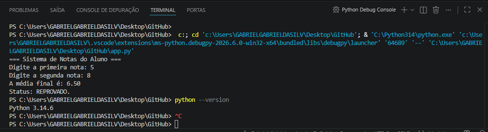

# Calculadora de Média

Calcula a nota media de um aluno

## Como Executar
python - 3.14.6

Você precisa de um programa para rodar
abrir um terminal, dar f5, e rodar o programa 

Gabriel da Silva, Email - gabrielsoliveira1205@gmail.com